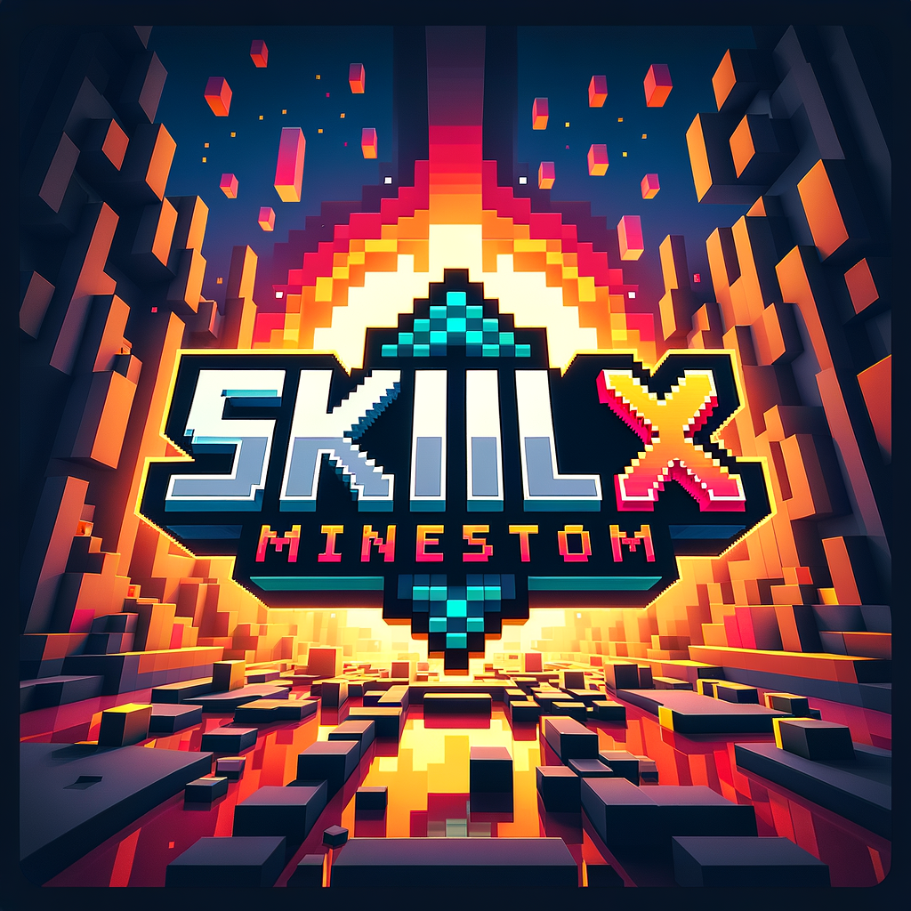

# SkillX

关于未来的服务端核心



---

 介绍
---

##### SkillX是基于Minestom所写的核心

##### 把模块化作为原则，任何地方都可拆卸

## 对比当下Spigot等NMS服务端有何优势与劣势？

- ### 优势
    - 对比NMS的闭源混淆，Minestom相对自由开放
    - eula暴毙
    - 插件接口条约的规范（对比Bukkit的插件乱象相对调谐）

- ### 劣势
    - 原版实现的不完全
    - 生态的不成熟

## 未来计划
- 2025 - 迁移SkillW全家桶至SkillX
- 2024.12 - 服务端正常开放启动（现在是11.17，没时间写了，开学了，等我两周后回归）
- 2025.1 - 接口条约的规范（开发者爽歪歪）
- 2025.2 - MobSystem（MythicMobs死！）
- 2025.7 - DungeonSystem
## plugin.conf

```hocon
name = "MobSystem"
main = "com.skillw.mobsystem"
version = "1.0.0"
authors = [
  C1ok,
  X1ok
]
depend = []
softDepend = []
dependencies {
  repositories = [
    {
      name = Central,
      url = "https://repo1.maven.org/maven2/"
    }, {
      name = JCenter,
      url = "https://jcenter.bintray.com/"
    }
  ]
  artifacts = ["net.minestom:minestom-snapshots:d955f51899"]
}
```